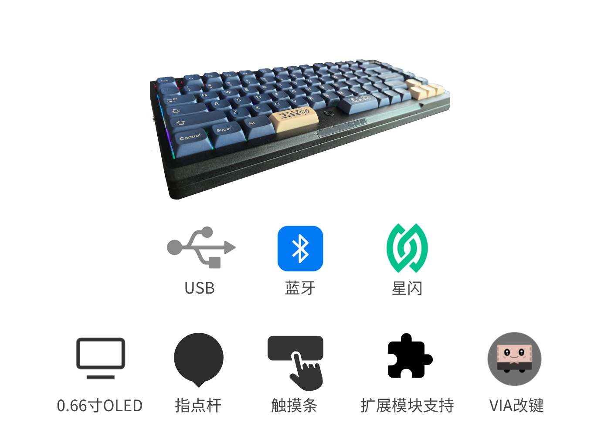
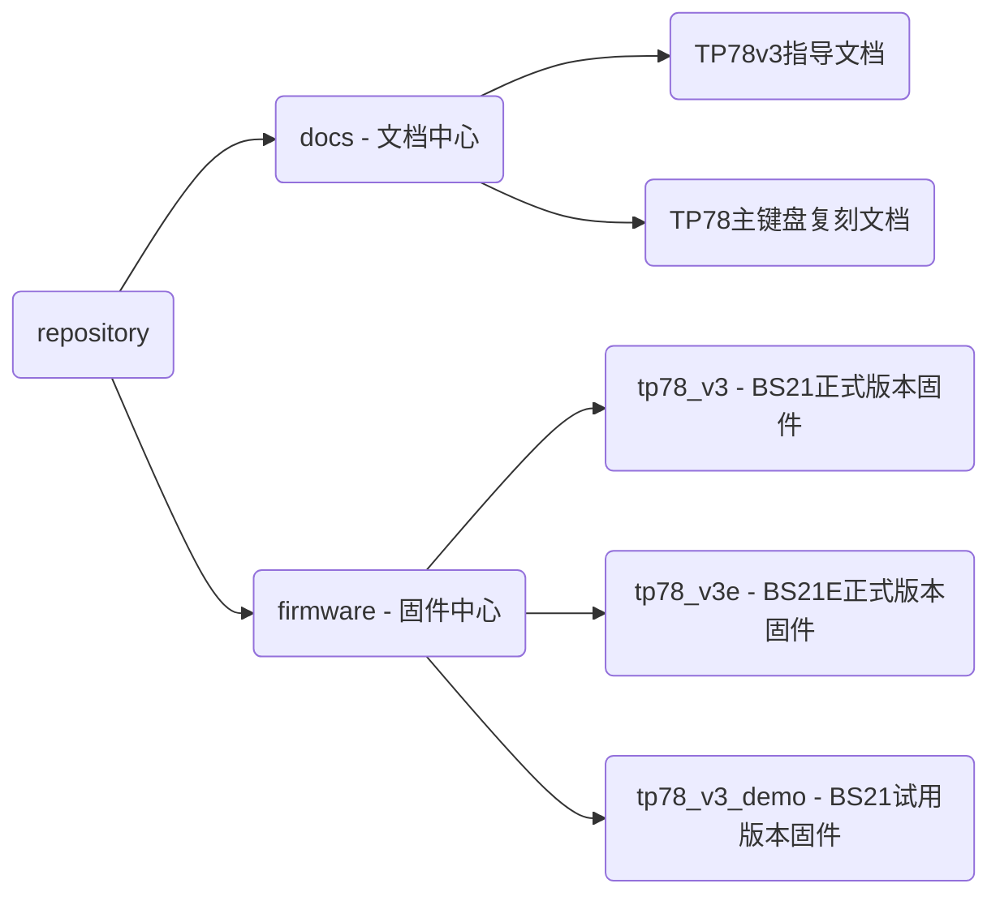

<h1 align="center">TrackPoint78 </h1>

<h5 align="center">小红点三模机械键盘方案</h5>

TP78是一套三模机械键盘方案。以满足带有小红点 便携 无线 自定义快捷键四大根本需求为出发点设计的退烧键盘。三模75%配列，带有小红点(指点杆)，并使用TouchBar实现鼠标左中右键。OLED、Hub和磁吸接口。外壳可使用拓竹A1mini打印拼装。

TP78v2使用CH582M作为主控核心，支持USB/BLE/RF三模，有线无线均1K回报率（[直达TP78v2仓库](https://github.com/ChnMasterOG/tp78_v2)）

TP78v3使用Hi2821/Hi2821E作为主控核心，支持USB/BLE/SLE三模，有线8K回报率，星闪2K回报率（当前仓库）

**（注意开源协议，GPL3.0，请尊重开源，欢迎交流，交流①群：678606780已满，交流②群：904775488）**

V3.0 视频展示：[BiliBili](https://www.bilibili.com/video/BV17P7DzeEUf/)

1. 支持有线8K回报率，硬件按键扫描功能
2. 集成无线星闪和接收器方案
3. 新版Gasket结构，支持CNC铝合金外壳
4. 支持VIA网页改键、修改配置
5. 支持Windows动态光效
6. 支持触摸条操作
7. 集成USB hub接口
8. 集成磁吸扩展口
9. 使用I2C小红点方案
10. 自研OELD UI动画
11. 多种Fn功能
12. 自动低功耗模式

### 关注我们 - 获取更多开源好玩的DIY小玩意

bilibili：@i丶m皮皮 @阿炜阿阿炜阿

### 购买链接

[淘宝(taobao.com)](https://item.taobao.com/item.htm?id=931696327490)

### TP78支持的扩展模块列表

扩展模块视频介绍：[https://www.bilibili.com/video/BV1jVpneNEpq/](https://www.bilibili.com/video/BV1jVpneNEpq/)

1. TP78foc —— 一个FOC控制无刷电机旋钮小键盘扩展模块
   
   购买链接：[淘宝(taobao.com)](https://item.taobao.com/item.htm?ft=t&id=828180761483)

2. TP78mini —— 一个三模数字小键盘模块
   
   购买链接：[淘宝(taobao.com)](https://item.taobao.com/item.htm?ft=t&id=832953135960)

### 硬件开源地址

TBD

### VIA改键和键盘使用教程

https://via.modtrack.top

### 仓库目录

### Q&A

- Q：正式版固件和试用版本固件有什么区别？

- A：正式版固件需要配套官方购买的板子/芯片/模组，其板子带license，如果板子不带license则刷入正式版本固件也无法使用。试用版本固件可支持任意渠道购买的板子/芯片/模组。试用版本的固件仅支持星闪单模连接，不支持星闪低延迟模式，不支持固件配列修改，不支持扩展模块连接。

- Q：正式版本固件的板子刷成试用版本是否会有问题？

- A：可能会有问题，因此升级前请确定固件是否为正式版固件。
  
  *其他Q&A详见指导文档*

### BUG提交

当你在使用中遇到问题，可以在[这里](https://github.com/ChnMasterOG/tp78_v3_open/issues)提交你的反馈。
